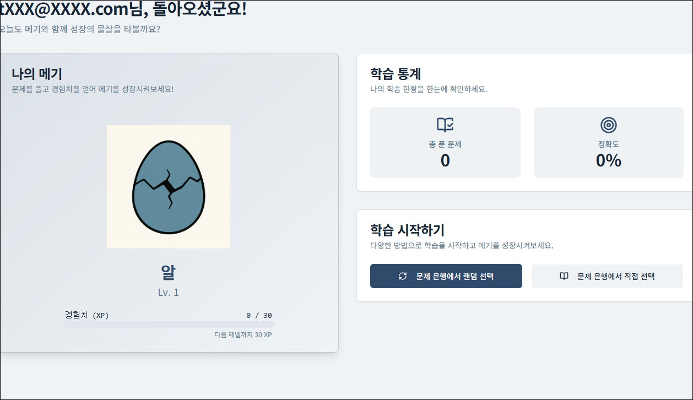
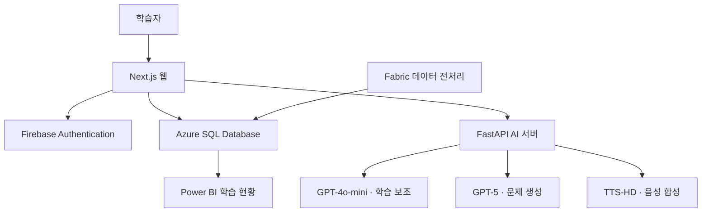
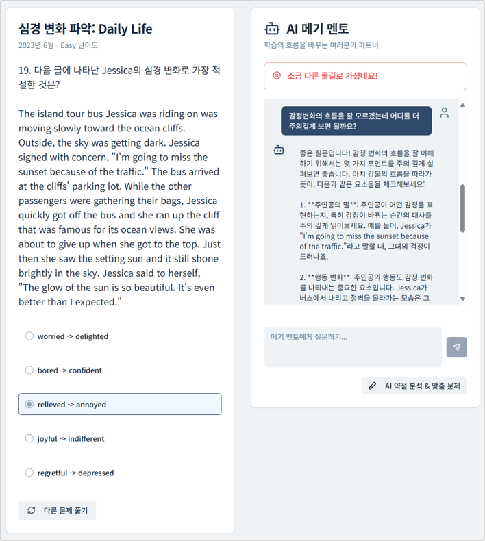
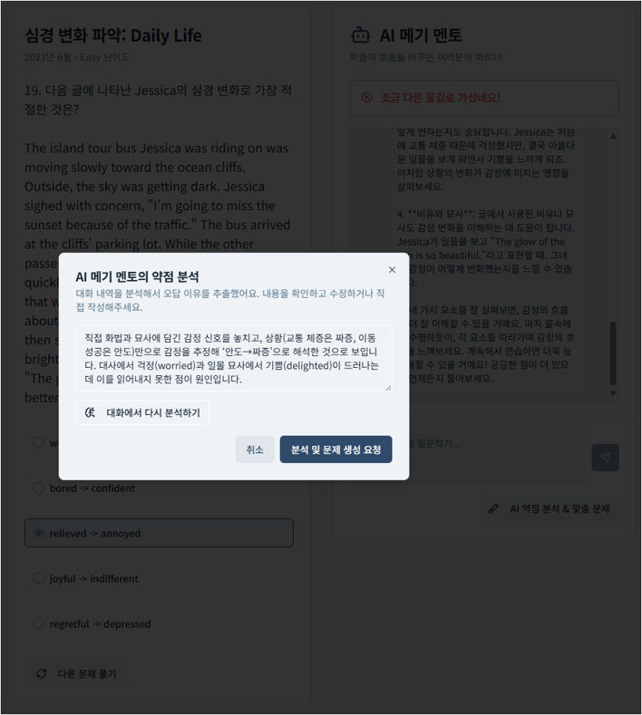
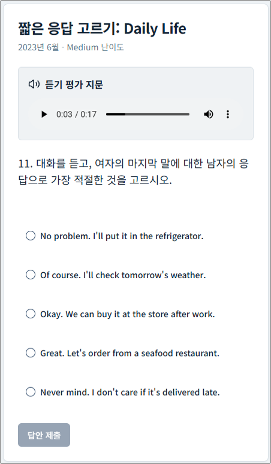

# 🐟 메기스터디 — AI 기반 수능 영어 학습 서비스

> 오답에 대한 대화를 바탕으로 학습자의 취약점을 분석하고, 맞춤형 문제와 다화자 듣기 음성을 제공하는 영어 학습 서비스입니다.

## 1. 프로젝트 요약

| 항목 | 내용 |
|---|---|
| 개발 형태 | 4인 팀 프로젝트 · 개발 3명, 발표자료 및 기타 업무 1명 |
| 개발 기간 | 2025.08.27 ~ 2025.09.26 |
| 본인 | 임승수 · AI 서비스 설계 및 구현 |
| 핵심 담당 | FastAPI AI 서버, 웹의 AI 호출 연동, 프롬프트 설계, 개인화 문제 생성 흐름, 다화자 TTS |
| 핵심 기술 | Python, FastAPI, LangChain, Azure OpenAI, Next.js, TypeScript |
| 팀 서비스 구성 | Microsoft Fabric, Azure SQL Database, Firebase Authentication, Power BI |
| 현재 상태 | 클라우드 서비스 운영 종료 · 코드, 서비스 화면, 발표자료 공개 |

## 2. 주요 결과 미리보기

### 서비스 대표 화면

### 핵심 구현 결과

- **웹과 AI 서버의 역할 분리**  
  Next.js 웹에 FastAPI AI 서버를 연결하고, 챗봇·문제 생성·음성 생성 기능을 API로 제공했습니다.

- **오답에서 새 문제 생성까지 연결**  
  문제와 대화 이력을 바탕으로 취약점을 분석하고, 사용자가 분석 내용을 확인·수정한 뒤 유사 문제를 생성하도록 구성했습니다.

- **듣기 대본의 화자별 음성 생성**  
  대본을 화자별로 분리하고 서로 다른 음성으로 합성한 뒤, 웹에서 재생할 수 있도록 제공했습니다.

[발표자료 보기](docs/presentation.pdf) · [서비스 화면 보기](docs/images/) · [AI 서버 코드 보기](ai_server/)

## 3. 프로젝트 목적과 핵심 기능

### 해결하려던 문제

정답과 해설만 확인하는 학습 방식으로는 학생이 어떤 부분에서 잘못 이해했는지 파악하기 어렵습니다. 해설을 이해한 뒤에도 같은 취약점을 연습할 후속 문제가 필요합니다.

메기스터디는 **문제 풀이 → 질문과 해설 → 취약점 분석 → 맞춤형 문제 생성**을 하나의 학습 흐름으로 연결하는 것을 목표로 했습니다.

### 팀 전체 구현 기능

| 기능 | 내용 |
|---|---|
| 문제 은행 | 영어 문제 검색·필터링 및 문제 풀이 |
| AI 학습 멘토 | 문제·해설과 사용자의 오답을 참고한 설명 및 추가 질문 응답 |
| 취약점 분석 | 오답과 대화 이력을 바탕으로 학습자의 혼동 지점 요약 |
| 맞춤형 문제 생성 | 취약점과 기존 문제의 메타데이터를 활용한 유사 문제 생성 |
| 듣기 음성 생성 | 대본의 화자를 구분하여 듣기 문제 음성 제공 |
| 학습 기록 | 풀이 결과와 생성 문제 저장, 학습 현황 확인 |
| 학습 동기 부여 | 학습 이력에 따른 메기 캐릭터 성장 |

> 위 기능은 팀 전체 결과물입니다. 본인의 담당 범위는 다음 항목에 구분했습니다.

## 4. 본인 담당 역할

**기존 Next.js 웹에 AI 기능을 연결하는 구조를 결정하고, FastAPI AI 서버와 웹의 AI 호출 연동을 담당했습니다.**

| 담당 영역 | 수행 내용 | 관련 코드 |
|---|---|---|
| AI 서버 설계 | FastAPI 앱 구성, 기능별 라우터와 서비스 계층 분리 | [main.py](ai_server/main.py), [api](ai_server/api/), [services](ai_server/services/) |
| 웹·AI 연동 | Next.js에서 AI 서버로 요청하고 응답을 서비스 기능에 연결 | [actions.ts](src/lib/actions.ts) |
| 학습 보조 챗봇 | 문제·해설·대화 이력을 반영한 프롬프트 및 멀티턴 처리 | [agent.py](ai_server/api/agent.py), [agent_service.py](ai_server/services/agent_service.py) |
| 개인화 문제 생성 | 취약점 분석과 유사 문제 생성 흐름 및 모델 호출 구현 | [generation.py](ai_server/api/generation.py), [azure_client.py](ai_server/services/azure_client.py) |
| 다화자 TTS | 화자 구분, 문장 분리, 음성 합성 및 병합 처리 | [tts.py](ai_server/api/tts.py), [tts_utils.py](ai_server/services/tts_utils.py) |
| API 연동 문제 해결 | 공식 문서를 확인하여 Azure OpenAI 호출 코드와 설정 조정 | [azure_client.py](ai_server/services/azure_client.py), [config.py](ai_server/core/config.py) |

Fabric 기반 데이터 수집·정제, 데이터베이스 구축·보안, 생성 문제의 DB 저장은 팀 전체 구현 범위로 구분합니다.

개발에는 AI 코딩 도구를 활용했으며, 서비스 아키텍처 결정, 공식 문서 확인, 생성 코드의 적용 여부 판단과 기능 확인을 직접 수행했습니다.

## 5. 시스템 구조와 기술 선택

### 서비스 요청 흐름

팀 서비스의 주요 구성과 요청 흐름을 요약한 다이어그램입니다.

### 웹과 AI 서버 분리

| 구성 요소 | 역할 |
|---|---|
| Next.js | 사용자 화면, 인증·DB 연동, AI 서버 요청 및 응답 표시 |
| FastAPI | 학습 보조, 취약점 분석, 문제 생성, TTS 처리 |
| Azure OpenAI | 기능별 언어 모델 및 음성 합성 호출 |
| Azure SQL Database | 문제, 사용자, 학습 기록 등 저장 |
| Microsoft Fabric | 원본 학습 자료의 수집·전처리 |
| Firebase Authentication | 사용자 인증 |

AI 처리 로직을 Python 서버에 모으고, 웹에서는 API를 통해 기능을 사용하도록 구성했습니다.

### 기능별 모델 선택

| 기능 | 사용 모델 | 선택 이유 |
|---|---|---|
| 학습 보조 챗봇 | GPT-4o-mini | 문제·해설 컨텍스트를 활용한 질의응답에서 응답 속도와 비용 고려 |
| 맞춤형 문제 생성 | GPT-5 | 취약점, 문제 유형, 난이도 등 여러 조건을 반영하는 생성 작업 |
| 듣기 음성 생성 | TTS-HD | 대본을 음성으로 변환 |

초기에는 챗봇과 문제 생성을 하나의 모델로 처리했으나, 기능별 요구에 맞춰 모델을 분리했습니다. 모델명은 발표 당시 사용 구성을 기준으로 정리했습니다.

## 6. 주요 구현과 문제 해결

### 6-1. 문제 컨텍스트와 대화 이력을 활용한 학습 보조

**과제**

학생의 추가 질문에 답하려면 현재 문제뿐 아니라 이전에 어떤 설명과 질문이 오갔는지도 반영해야 했습니다.

**구현**

- 문제·해설·사용자 선택 정보를 프롬프트에 반영
- 이전 대화 이력을 메시지 형태로 구성
- LangChain의 프롬프트 및 메시지 처리를 활용해 후속 질문에 연결
- 기능별 API와 공통 서비스 로직 분리

**결과**

오답에 대한 설명에서 끝나지 않고, 사용자가 이해하지 못한 부분을 추가로 질문할 수 있는 학습 보조 흐름을 구현했습니다.

관련 코드: [agent_service.py](ai_server/services/agent_service.py)

### 6-2. 사용자가 확인·수정하는 개인화 문제 생성

**과제**

같은 문제를 틀렸더라도 학생마다 혼동한 이유가 다를 수 있습니다. 정오답만으로 문제를 생성하기보다 대화에서 드러난 취약점을 반영하도록 설계했습니다.

**처리 흐름**

1. 오답 문제와 사용자·AI의 대화 이력 확인
2. 사용자가 혼동한 지점을 분석하고 요약
3. 사용자가 분석 내용을 확인하거나 수정
4. 취약점과 기존 문제의 유형·난이도 등 메타데이터를 바탕으로 새 문제 생성
5. 팀의 DB 저장 기능과 연결하여 생성 문제 제공

AI가 분석한 내용을 사용자가 수정할 수 있도록 하여, 문제 생성 전에 학습자의 의도를 반영할 수 있게 했습니다.

관련 코드: [generation.py](ai_server/api/generation.py), [AI 멘토 화면](src/components/ai-mentor.tsx)

### 6-3. 규칙 기반 전처리를 활용한 다화자 TTS

**과제**

듣기 대본 전체를 하나의 음성으로 읽으면 화자 전환을 구분하기 어렵습니다. 대화형 문제에 맞게 화자를 나누어 음성을 생성해야 했습니다.

**구현**

- `M:`, `W:`, `Man:`, `Woman:` 등 화자 표기를 정규식과 규칙으로 식별
- 화자별 발화 구간 분리
- 구간별 음성을 선택하여 TTS 호출
- 생성된 음성 세그먼트를 병합
- 웹에서 재생 가능한 WAV 데이터 URI로 반환

**결과**

화자별로 음성이 달라지는 듣기 콘텐츠를 생성하고, 문제 화면의 오디오 플레이어에서 재생하도록 연결했습니다.

관련 코드: [tts.py](ai_server/api/tts.py), [tts_utils.py](ai_server/services/tts_utils.py), [azure_client.py](ai_server/services/azure_client.py)

### 6-4. Azure OpenAI 호출 오류 대응

**문제**

Azure OpenAI 연동 과정에서 호출 코드와 실제 API 사용 방식이 맞지 않아 오류가 발생했습니다.

**대응**

- 공식 문서에서 해당 모델의 호출 방식 확인
- 엔드포인트, 배포 이름, API 버전 및 요청 형식 점검
- 확인한 내용을 바탕으로 호출 코드 수정 및 기능 확인

**학습**

AI 코딩 도구가 생성한 코드도 사용하는 서비스의 API 규격과 일치하는지 검증해야 한다는 점을 경험했습니다.

관련 코드: [Azure 클라이언트](ai_server/services/azure_client.py), [설정 모듈](ai_server/core/config.py)

## 7. 구현 결과와 한계

### 확인 가능한 결과

| 항목 | 확인 자료 |
|---|---|
| 웹·AI 서버 분리 | Next.js 호출 코드, FastAPI 라우터 및 서비스 구조 |
| 멀티턴 학습 보조 | 대화 이력 처리 코드 및 서비스 화면 |
| 취약점 분석·사용자 수정 | 분석 API와 수정 화면 |
| 맞춤형 문제 생성 | 생성 API 및 발표자료 |
| 화자별 듣기 음성 생성 | TTS 전처리·합성 코드 및 재생 화면 |
| 팀 서비스 통합 | 발표자료의 데이터 구조, 학습 기록 및 서비스 화면 |

### 검증 범위와 한계

- 서비스 기능과 동작 사례를 중심으로 결과를 제시합니다. 학습 효과나 생성 문제 품질을 정량적으로 검증한 결과는 포함하지 않습니다.
- 모델 분리의 비용 절감률과 응답 시간은 엄격한 비교 실험으로 측정하지 않아 수치 성과로 제시하지 않습니다.
- 대화 이력을 전달하는 멀티턴 기능과 영구적인 장기 기억은 구분합니다. Cosmos DB 기반 장기 기억은 별도 PoC를 진행했으나 최종 서비스 구현에는 포함하지 않았습니다.
- 생성 문제와 해설의 정확성을 보장할 수 없으므로 교육 콘텐츠로 활용할 때 검토가 필요합니다.
- 현재 클라우드 리소스와 API 연결은 종료되어 서비스 접속 및 실시간 기능 체험은 제공하지 않습니다.

## 8. 기술 스택과 프로젝트 확인 방법

### 기술 스택

| 영역 | 사용 기술 |
|---|---|
| AI 서버 | Python, FastAPI, Uvicorn |
| LLM 연동 | Azure OpenAI, OpenAI Python SDK, LangChain |
| 요청·응답 구조 | Pydantic |
| 웹 | Next.js, React, TypeScript, Tailwind CSS |
| 데이터베이스 — 팀 | Azure SQL Database |
| 데이터 처리 — 팀 | Microsoft Fabric |
| 인증 — 팀 | Firebase Authentication |
| 시각화 — 팀 | Power BI |

### 의존성 명세

| 항목 | 공개 파일의 버전 표기 |
|---|---|
| Next.js | `15.3.3` |
| React | `^18.3.1` |
| TypeScript | `^5` |
| LangChain | `>=0.2.14` |
| langchain-openai | `>=0.1.23` |
| FastAPI · OpenAI SDK · Pydantic | 버전 미고정 |

위 표는 의존성 파일에 선언된 값입니다. 범위로 지정되거나 고정되지 않은 패키지는 당시 설치 버전과 구분해야 합니다.

[AI 서버 의존성](ai_server/requirements.txt) · [웹 의존성](package.json)

### 주요 AI API

| API | 기능 |
|---|---|
| `/v1/agent-chat` | 학습 보조 질의응답 |
| `/v1/multi-turn-chat` | 대화 이력을 활용한 후속 질의응답 |
| `/v1/extract-mistake-reason` | 오답 이유 및 취약점 분석 |
| `/v1/generate-similar` | 유사 문제 생성 |
| `/v1/generate-audio` | 듣기 음성 생성 |

### 프로젝트 확인 방법

이 저장소는 운영이 종료된 클라우드 프로젝트의 코드와 결과를 정리한 아카이브입니다.

| 확인 목적 | 참고 자료 |
|---|---|
| 전체 프로젝트와 팀 역할 | [발표 PDF](docs/presentation.pdf) |
| 사용자 화면과 기능 흐름 | [서비스 이미지](docs/images/) |
| AI 서버 구조 | [ai_server](ai_server/) |
| 프롬프트·대화 처리 | [agent_service.py](ai_server/services/agent_service.py) |
| 문제 생성·TTS 호출 | [azure_client.py](ai_server/services/azure_client.py) |
| 웹의 AI 호출 연동 | [actions.ts](src/lib/actions.ts) |

## 9. 관련 자료

- [팀 발표자료](docs/presentation.pdf)
- [서비스 대표 화면](docs/images/service-overview.png)
- [AI 멘토 대화 화면](docs/images/ai-mentor.png)
- [취약점 분석·문제 생성 화면](docs/images/personalized-generation.png)
- [듣기 음성 재생 화면](docs/images/listening-tts.png)
